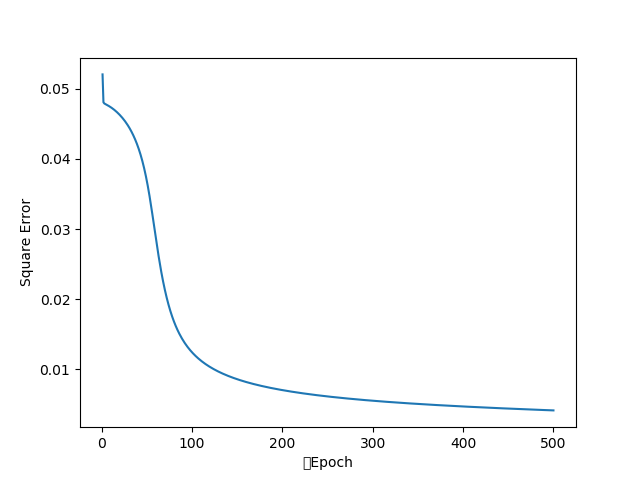
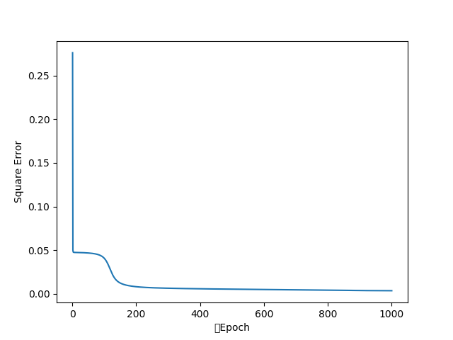
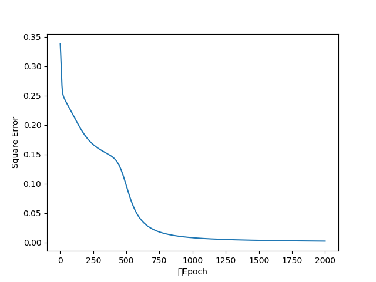

# ニューラルネットワーク

ニューラルネットワーク(全結合)のモジュールを作成した。

* src/lib/layer.py
  * 層クラス: Layer (中間層, 出力層)
* src/lib/neuralnetwork.py
  * ネットワーククラス: NeuralNetwork
  * 層の管理を担う


---


## サンプルプログラムの実行

ここでは3つ用意した。

* src/sample-3L.py
* src/sample-4L.py
* src/sample-xor.py


### sample-3L

```
python src/sample-3L.py
```

**扱うデータについて**

| サンプル名 | 値 |
| :- | :- |
| 学習 | 500 |
| 評価 | 100 |

特徴ベクトル $\vec{x} = (x_0, x_1, x_2, x_3)$ , $0.0 \leq x_i < 0.5$

ラベルベクトル $\vec{y} = (y_0, y_1)$

特徴ベクトルの要素の合計値が1.5以上ならば$y_0 = 0, y_1 = 1$とする。1.5未満ならば$y_0 = 1, y_1 = 0$とする。

**モデルについて (3層)**

| 層名 | ユニット数 |
| :- | :- |
| 入力 | 4 |
| 中間 | 6 |
| 出力 | 2 |

**パラメータについて**

| パラメータ名 | 値 |
| :- | :- |
| 学習率 | 0.2 |
| エポック数 | 500 |

下図は、1エポック単位の平均誤差をプロットしたもの。




---


### sample-4L

```
python src/sample-3L.py
```

**扱うデータについて**

上記の3層のサンプルと同じ

**モデルについて (4層)**

| 層名 | ユニット数 |
| :- | :- |
| 入力 | 4 |
| 中間 | 4 |
| 中間 | 3 |
| 出力 | 2 |

**パラメータについて**

| パラメータ名 | 値 |
| :- | :- |
| 学習率 | 0.1 |
| エポック数 | 1000 |

下図は、1エポック単位の平均誤差をプロットしたもの。



幾度か試行したが、問題に対して複雑なモデルにすると学習がうまくいかないことがわかった。


---


### sample-xor

```
python src/sample-xor.py
```

**データについて**

| $x_0$ | $x_1$ | $y_0$ | $y_1$ |
| :-: | :-: | :-: | :-: |
| 0 | 0 | 1 | 0 |
| 0 | 1 | 0 | 1 |
| 1 | 0 | 0 | 1 |
| 1 | 1 | 1 | 0 |

**モデルについて (3層)**

| 層名 | ユニット数 |
| :- | :- |
| 入力 | 2 |
| 中間 | 4 |
| 出力 | 2 |

**パラメータについて**

| パラメータ名 | 値 |
| :- | :- |
| 学習率 | 0.4 |
| エポック数 | 2000 |


